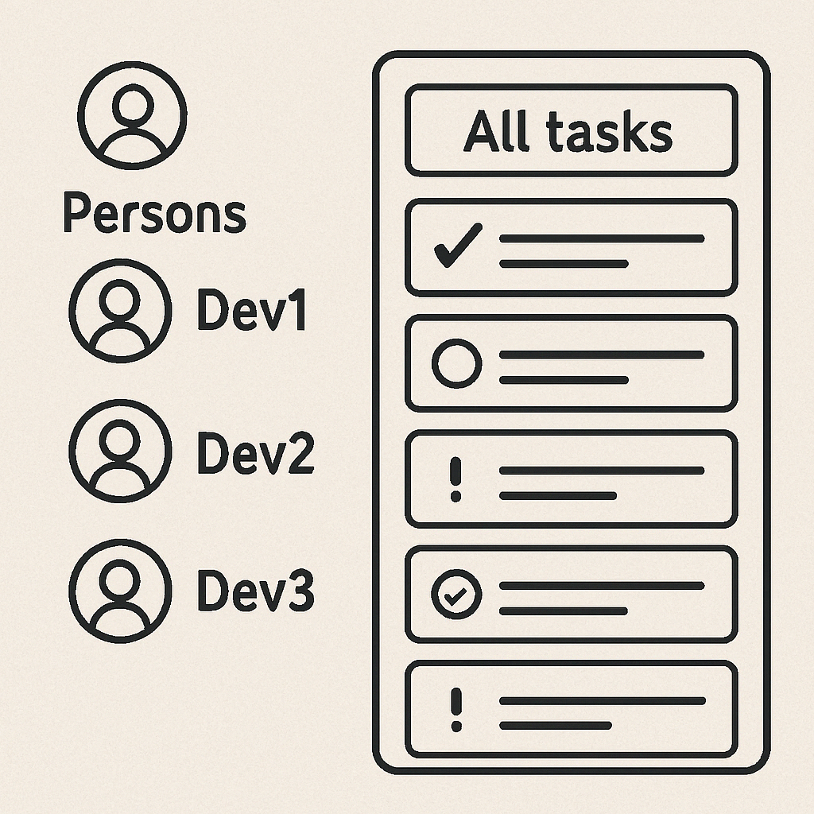

# Todo Application


## Objective
This is a simple yet functional Todo Application built using Spring Boot and JPA. The app allows users (persons) to
manage tasks, track completion status, and monitor due dates. Tasks can be assigned to specific users or left
unassigned. The application automatically records creation and update timestamps for each task. It is designed with a
clean architecture and follows best practices in Java development.

### Class Diagram

```
+-------------------+          +-------------------+
|     Person        |1        *|       Todo        |
+-------------------+----------+-------------------+
| - id              |          | - id              |
| - name            |          | - title           |
| - email           |          | - description     |
+-------------------+          | - completed       |
                               | - createdAt       |
                               | - updatedAt       |
                               | - dueDate         |
                               | - person (FK)     |
                               +-------------------+
```

### Person

```java
public class Person {
    Long id;
    String name;
    String email;
}
```

- Represents a user in the system.
- Each person has a unique email address.
- Can be assigned multiple todo tasks.

### Todo

```java
public class Todo {
    Long id;
    String title;
    String description;
    boolean completed;
    LocalDateTime createdAt;
    LocalDateTime updatedAt;
    LocalDateTime dueDate;
    Person person;
}
```

#  Functionalities
- PersonRepository
  - Find all persons.
  - Find person by email.
  - Save a new person.
  - Update an existing person.
  - Delete a person.
- TodoRepository
  - Find all todos.
  - Find todo by ID.
  - Save a new todo.
  - Update an existing todo.
  - Delete a todo.